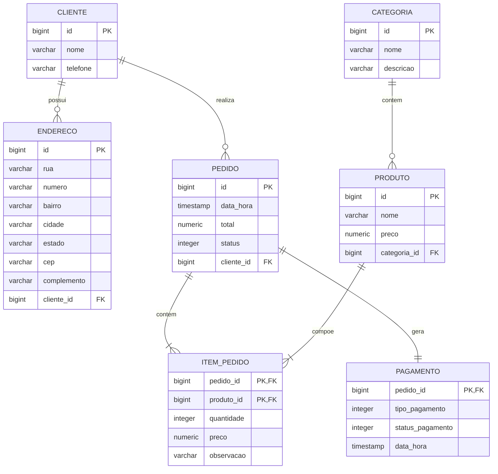

# 🍕 Pizzaria API

Uma API RESTful moderna para gerenciamento completo de uma pizzaria, abrangendo desde o catálogo de produtos e categorias até a gestão de clientes, pedidos, itens e pagamentos.

> 🚧 **Status do Projeto:** Em desenvolvimento (Fase de Camada de Persistência / Repositories)

---

## 🛠️ Tecnologias Utilizadas

- **Linguagem:** Java 25
- **Framework:** Spring Boot 4.x
- **Persistência & ORM:** Spring Data JPA / Hibernate 7
- **Banco de Dados:** PostgreSQL 17
- **Ambiente Contêinerizado:** Docker & Docker Compose
- **Gerenciador de Dependências:** Apache Maven
- **Produtividade:** Project Lombok & Jakarta Bean Validation

---

## 🗄️ Modelo de Domínio (Entidades)

O modelo de dados foi estruturado com foco em integridade relacional e boas práticas de mapeamento JPA:



---

## 🚀 Como Executar o Projeto Localmente

### Pré-requisitos
- **Docker** e **Docker Compose** instalados
- **Java 25+** (opcional caso use o wrapper Maven local)

### 1. Clonar o repositório
```bash
git clone git@github.com:jailsonribeirodev-sys/pizzaria-api.git
cd pizzaria-api
```

### 2. Iniciar o Banco de Dados (PostgreSQL + pgAdmin)
```bash
docker compose up -d
```
- **PostgreSQL:** `localhost:5435` (banco: `pizzaria`, user/pass: `postgres`/`postgres`)
- **pgAdmin 4:** `http://localhost:15435`

### 3. Executar a Aplicação Spring Boot
```bash
./mvnw spring-boot:run
```
A API iniciará na porta **8083** (configurada em `src/main/resources/application.yaml`).

---

## 🗺️ Roadmap de Desenvolvimento

- [x] Modelagem de Domínio e Mapeamento JPA
- [x] Ambiente de Banco de Dados com Docker Compose
- [ ] Implementação da Camada de Repositórios (`Spring Data JPA`)
- [ ] Carga Inicial de Dados para Testes (`Seed / CommandLineRunner`)
- [ ] Regras de Negócio e Serviços (`Service Layer`)
- [ ] DTOs (Data Transfer Objects) e Validações
- [ ] Endpoints RESTful (`Controllers`)
- [ ] Tratamento Global de Exceções (`ProblemDetail` / `@ControllerAdvice`)
- [ ] Documentação de API com Swagger/OpenAPI
- [ ] Testes Automatizados (Unitários e Integração)

---

## 👤 Autor

Desenvolvido por **Jailson Ribeiro**.
